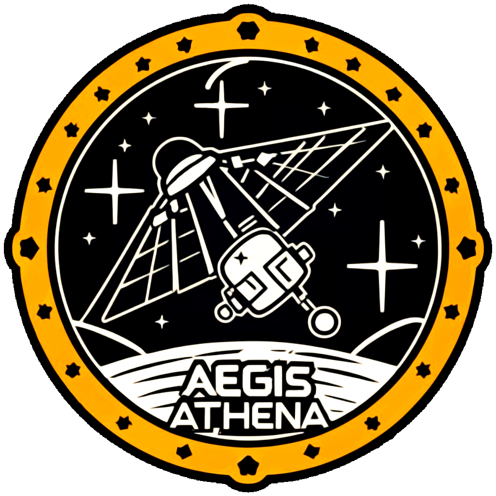
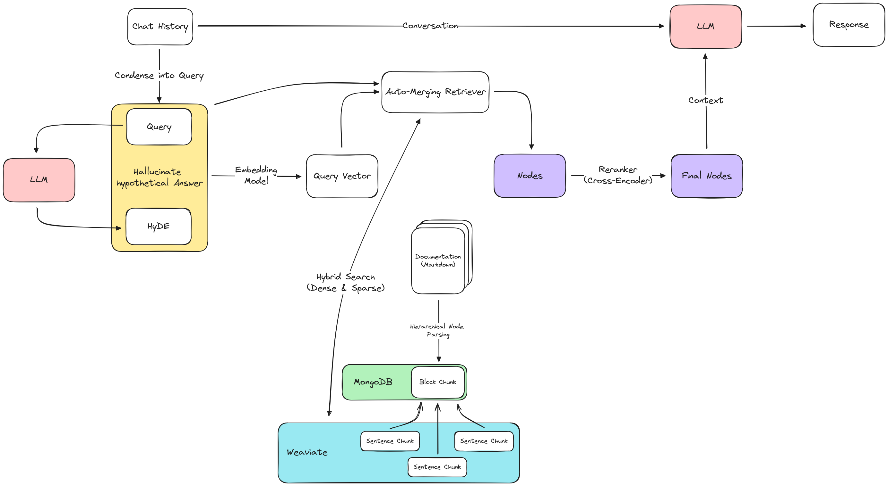

# Aegis Athena: Project "Shielded Wisdom"

## Welcome!

**Aegis Athena** is a little side-project for showcasing the capabilities of RAG. The user is thrown into an completely unknown environment (a spaceship) and is given the task of solving a unknown problem in that environment. An LLM powered RAG pipeline is supposed to aid the user in solving that problem by providing answers to the user's questions concerning this specific domain.

## Limitations

Although I achieved much better results, when using custom ReAct-like LLM agents, these pipelines require (only personal experience) very capable models (like GPT-4) to run satisfactorily. Thus, the main problem with this approach are the comparatively high operation costs.

This is why I used a simpler, less capable pipeline architecture.

## Retrieval Augmented Generation

## Technologies

- [LlamaIndex](https://docs.llamaindex.ai/en/stable/): framework for implementing RAG pipelines and LLM Agents
- [Streamlit](https://docs.streamlit.io/): web app framework for AI/ML engineers and data scientist
- [Weaviate](https://weaviate.io/developers/weaviate): vector DB
- [Pydantic](https://docs.pydantic.dev/latest/): data validation library
- [TruLens](https://github.com/truera/trulens/): RAG evaluation framework
- [Arize Phoenix](https://docs.arize.com/phoenix/): AI observability framework
- [Ollama](https://ollama.com/): running LLM locally
- [MongoDB](https://www.mongodb.com/docs/): document DB

## Contributing

Feel free to fork the project, create a feature branch, and send me a pull request!

## License

This project is licensed under the [MIT License](https://github.com/Kangonaut/aegis-athena/blob/main/LICENSE).

## Contact

You can reach out to me through [Reddit](https://www.reddit.com/user/Kangonaut/). I'd love to chat about this project or any other interesting topics!

---

